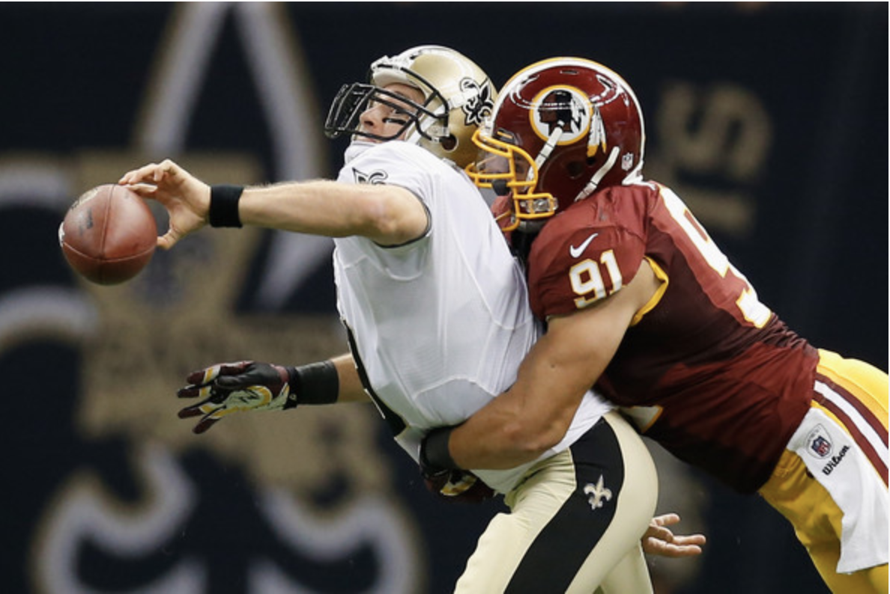

# Bench or Bust? #
## Making more accurate decisions about player injuries ##

### Introduction ###

We've all done it. It's 5 minutes before kickoff and your #1 wide reciever "tweaked his knee" last week giving him the big, fat "Q" next to his name. He's in uniform and warming up but definitely not at 100%. You have your replacement guy in the lineup just in case but this could be a 20 point swing if you get it wrong. At the final moment you think #1 is looking spry so you swap him back into your lineup just to watch with dismay as he stands on the sideline the ENTIRE game. The bench guy only ends up scoring 5 points but you lose by 3. 

It's obvious to any seasoned Fantasy Footballer that the "predictions" are often wrong. I'd like to propose an algrorithm that could help you make the bench or bust call with more confidence. There are several measures of point projection accuracy out there but no real statistical analysis of injury analysis. With our algorithm you could have a powerful tool to edge you over your friends and avoid the ever-dreaded last-place punishment.  

### Navigating the Repo ###

 - Data Folder: Contains csv files used for analysis
 - Ipynbs: 
 		- Analyses 
 		- Prediction 
 - Slidedeck 

### Methodology ###

Dataset: https://www.kaggle.com/c/nfl-playing-surface-analytics/overview

The Data Analysis included an indepth statistical analysis and visualization techniques. The prediction process included evaluation of 5 different algorithms. 

### Data Analysis ###

The following conclusions were derived from the data analysis:

1. Knee and Ankle injuries occur at similar rates
2. Injuries occur at similar rates on grass and turf. 
3. Wide Reciever, Defensive Back, and Linebacker are most frequently injured, mostly ankle/knee.
4. Knee/Ankle injuries most commonly miss <3 weeks, while foot injuries are always >2 months
5. Grass and Turf don't appear to have a significant effect on time missed.
6. Time missed is quite variable throughout position groups, but an interesting note that
tight ends, runningbacks, and defensive lineman are never out for less than 1 week.

### Prediction Model ### 

The following features are the highest predictors of days missed. 

1. Body Part (Ankle, Foot, Knee)
2. Position Group (Linebacker)
3. Field Type (Natural)

Our model is able to predict 10% better than random guessing how long the player will missed based on these five factors.

### Live Demonstration ###

Navigate to this notebook to input your own information for you fantasy prediction:

https://github.com/carlyf15/Module_3_Project/blob/master/Prediction.ipynb

### Futher Recommendations ###

This dataset was designed to describe the relationship between field type and players in the NFL. As such, the injury data is only lower extremity, is very none specific, and only has 77 entries. This algorithm would benefit from a much larger dataset as well as much more information regarding current and previous injuries. 